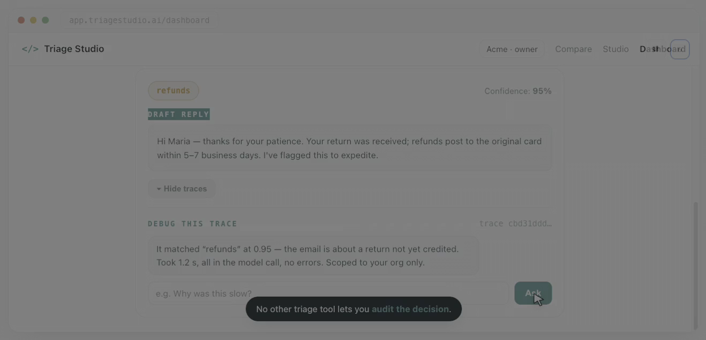
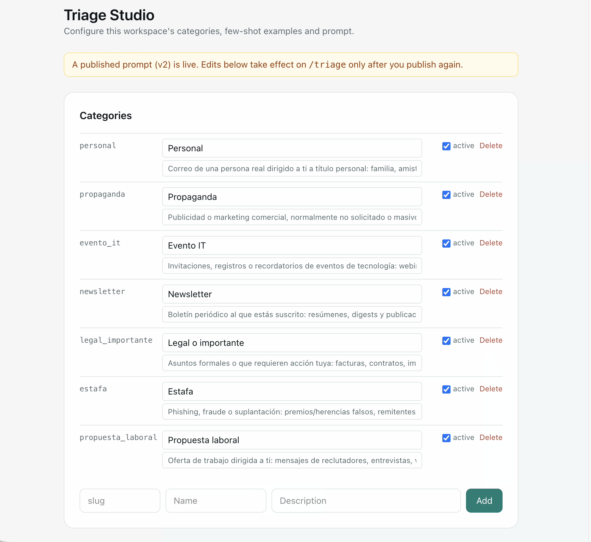
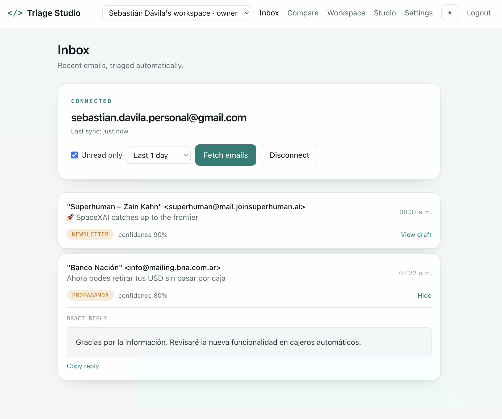
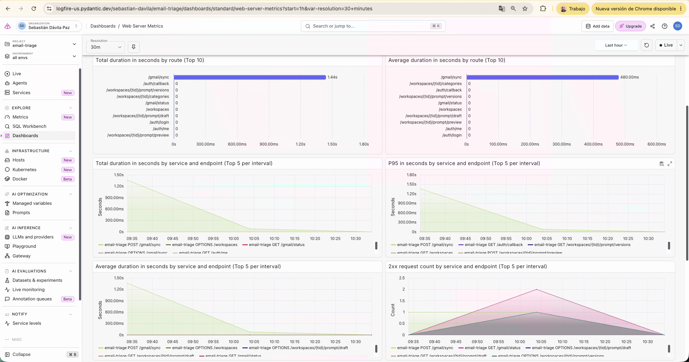
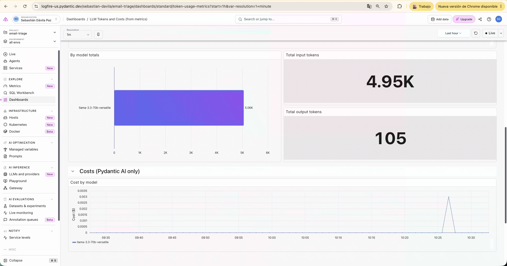
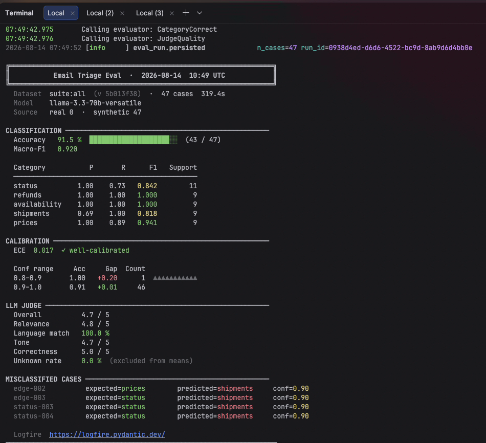
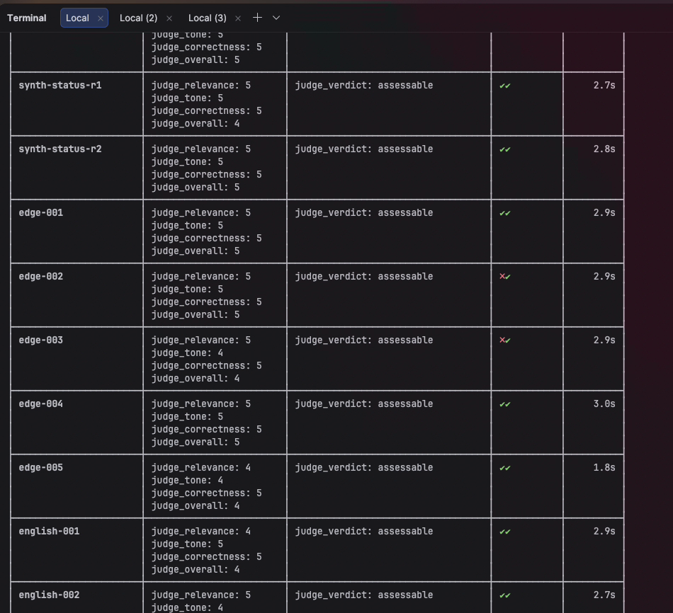

<div align="center">

# Triage Studio

**Support inbox triage your team can actually configure — not a black-box classifier.**

Every inbound support email gets sorted into *your* categories and gets a drafted reply, in the sender's language, with a calibrated confidence score — in under 3 seconds, for a fraction of what Zendesk or Intercom charge per seat.

[**Live app**](https://email-triage-ten-swart.vercel.app) · [**API docs**](https://email-triage.fastapicloud.dev/docs) · [Architecture](#architecture) · [Why it's built this way](#engineering-decisions-and-trade-offs)

</div>

---

[](docs/media/demo.mp4)
*42s walkthrough: classify an email, see the drafted reply and confidence score, then ask the trace-debug agent why it decided what it decided.*

## The problem

E-commerce support inboxes drown in the same five or six questions — *where's my order, can I get a refund, is this back in stock* — and founders either burn 1–2 hours a day answering them by hand or pay for a full helpdesk platform to do it. Triage Studio classifies and drafts replies for a support inbox at a cost per mailbox that a helpdesk seat can't match, without locking the founder into a rigid, one-size-fits-all taxonomy.

## What makes this different from a "call an LLM" script

Most triage demos are a single prompt hard-coded for one taxonomy. Triage Studio is a **multi-tenant platform**: every workspace owns its own categories, its own prompt, and its own few-shot examples — configured by a non-technical owner through a UI, governed by versioning and an evaluation gate so a bad edit can never reach production silently.

| | Generic LLM triage script | Triage Studio |
|---|---|---|
| Taxonomy | Hard-coded, one for everyone | Per-workspace, self-service CRUD |
| Prompt changes | Redeploy code | Draft → preview → publish, versioned, rollback in one click |
| Quality control | "Looks right" in a notebook | 47-case eval suite blocks publish if accuracy regresses |
| Multi-tenancy | None | RBAC (`owner`/`admin`/`member`) scoped to every query |
| Failure mode | 500 or a crash | Deterministic fallback to a safe legacy prompt — the critical path never breaks |
| Operability | Only through the UI you built | REST API **and** an MCP server, so any Claude client can run it |

---

## See it in action


*A real workspace's own taxonomy (not the five legacy defaults) — `owner`/`admin` CRUD, active/inactive toggle, and the published-version banner: "A published prompt (v2) is live. Edits below take effect only after you publish again."*


*Real inbox, connected via OAuth: each email arrives with a category, a confidence score, and a drafted reply ready to copy.*


*Live production telemetry: total/average duration and p95 by route, request volume by endpoint — every span traceable back to a `tenant_id`. This is the same data the trace-debug agent reads to answer "why did this triage behave that way?".*


*Input/output tokens and cost per model, live from Groq. This is the dashboard that keeps the [$9/mailbox unit economics](#engineering-decisions-and-trade-offs) honest instead of assumed.*


*A real run, not a cherry-picked one: 91.5% accuracy (43/47), macro-F1 0.920, ECE 0.017 ("well-calibrated"), LLM judge overall 4.7/5 — and the 4 misclassified cases listed by id, not hidden. `shipments` is the category dragging accuracy down here (0.69 precision, over-predicted on 4 edge/status cases), which is exactly the kind of signal the regression suite is meant to catch before a publish.*


*Each case scored on relevance, tone, correctness and language match individually — not just a single aggregate number — so a regression in one dimension (e.g. tone drifting on refunds) doesn't hide behind a passing average.*

---

## Try it

The app is deployed and running:

- **App:** [email-triage-ten-swart.vercel.app](https://email-triage-ten-swart.vercel.app) (Vercel)
- **API + interactive docs:** [email-triage.fastapicloud.dev/docs](https://email-triage.fastapicloud.dev/docs) (FastAPI Cloud)
- **Health check:** `GET https://email-triage.fastapicloud.dev/health`

Sign up, connect a Gmail inbox (read-only, revocable), and hit "Fetch today's emails" — or paste a sample email straight into `/docs` and call `POST /triage` with an API key.

---

## Architecture

```
                         ┌────────────────────────────┐
  Browser  ───fetch──▶   │  Vercel (React SPA)         │
  (Vercel, CORS)         │  Studio · Inbox · Dashboard │
                         └──────────────┬─────────────┘
                                        │ HTTPS (CORS-gated)
                                        ▼
                         ┌────────────────────────────┐
                         │  FastAPI Cloud (backend)    │
                         │  ── auth (JWT + API key)    │
                         │  ── RBAC (owner/admin/member)│
                         │  ── prompt compiler (F2/F3) │
                         │  ── evals + eval-gate       │
                         │  ── trace-debug agent       │
                         └──────┬──────────────┬───────┘
                                │              │
                     ┌──────────▼───┐   ┌──────▼────────┐
                     │ Neon (Postgres)│   │ Groq (Llama)  │
                     │ tenants, users,│   │ via Pydantic  │
                     │ categories,    │   │ AI, structured │
                     │ prompt versions│   │ output         │
                     └────────────────┘   └───────┬───────┘
                                                   │
                                          ┌────────▼────────┐
                                          │ Logfire (OTel)   │
                                          │ traces, metrics, │
                                          │ prompt registry  │
                                          └──────────────────┘
```

Three managed services, one contract: the backend needs the frontend's URL for CORS, the frontend needs the backend's URL for `VITE_API_URL`. No servers to patch, no containers to babysit — the whole stack is disposable infrastructure that redeploys from `git push`.

### How one `/triage` request is served

```
POST /triage  (X-API-Key)
  → verify_api_key            → resolves tenant_id (cached, sha256 + constant-time compare)
  → get_triage_service(tenant) → published prompt if the workspace has one,
                                  else the live-compiled draft,
                                  else the legacy static prompt (never fails)
  → agent.run(<email>...)      → Pydantic AI, structured output (Literal of the
                                  tenant's own category slugs, or "unknown")
  → validate against tenant's active slugs → coerce out-of-set → "unknown"
  → persist TriageLog + emit OTel span (tenant_id, category, confidence, latency)
```

One request, four moves, sub-3-second latency — no autonomous agent looping in the background on the hot path. That's a deliberate choice (see below).

---

## Engineering decisions and trade-offs

Every non-obvious call here was made on purpose, and each one trades something away. That's the part a demo doesn't show.

| Decision | What we gave up | Why |
|---|---|---|
| **Single-turn structured output, not an autonomous agent, on `/triage`** | Flexibility to handle unforeseen intents mid-request | Predictable latency and cost, and a result that's deterministically evaluable. The one loop that *is* justified — re-ask once if confidence is low, then fall back to `unknown` — is scoped and bounded, not open-ended. Multi-step agent loops are used deliberately elsewhere (trace diagnosis, tuning copilot) where the task genuinely needs tool-calling and iteration — not on the request path a customer is waiting on. |
| **Groq (free tier) as the LLM provider** | Frontier-model quality on hard cases | Unit economics: a $9/mailbox price point needs near-zero marginal LLM cost to be viable. The provider is abstracted behind one config value — switching to Anthropic/OpenAI when margin allows is a one-line change, not a rewrite. |
| **Prose prompts, XML tags only around examples and the untrusted email** | The illusion of extra rigor from wrapping everything in tags | Anthropic's own guidance: a tag earns its place when it separates a *type* of content. Here that's exactly two things — the few-shot block and the inbound email. Everything else reads better, and costs fewer tokens, as prose. |
| **The `<email>` tag as the injection boundary** | — | It's not decorative: the system prompt explicitly instructs the model to treat that block as data, never instructions. Negative few-shot examples include labelled injection attempts so the model has seen the pattern, not just been told about it. |
| **"Published wins if present" governance** | Zero-config simplicity for every workspace | A workspace that never publishes gets live-compiled prompts (instant edits, good for iterating). One publish freezes an immutable, versioned prompt behind an eval-gate with one-click rollback — governance for teams that need it, without forcing ceremony on teams that don't. |
| **Deterministic fallback everywhere on the critical path** | A single, "clean" code path | If Logfire, the DB, or the tenant's taxonomy is unreachable, `/triage` degrades to a safe static prompt instead of a 500. A support inbox tool that goes down is worse than one that temporarily serves last-known-good behavior. |
| **MCP server as a thin HTTP client, not embedded in the app** | A slightly shorter call stack | The MCP server never imports the app or touches the DB directly — it calls the same public API a browser would. RBAC and business rules live in exactly one place, and the same server works unmodified against the deployed instance. |
| **Legacy `Category` enum kept alongside the dynamic per-tenant taxonomy** | A "clean slate" migration | It's still the contract for the no-DB fallback and the offline eval baseline — so local dev, tests, and disaster-recovery mode never depend on a database being up. |

---

## Quality control: this isn't "vibes-based" AI

The single biggest risk in an LLM-backed product is a prompt edit that quietly makes classification worse. Triage Studio treats that as a release-engineering problem, not a "check it by hand" problem:

- **47-case evaluation suite** (`evals/`, on top of `pydantic-evals`): a 25-case **regression** suite, balanced 5-per-category, gates every prompt publish; a 22-case **capability** suite tracks trend on harder, ambiguous, multilingual, and tone-variant cases.
- **LLM-as-judge with an honest "unknown" verdict** — if the judge can't assess a reply, it's excluded from the quality mean instead of silently dragging the score in either direction (`judge_unknown_rate` is reported separately).
- **`pass^k`**: every case can be run *k* times to catch flakiness that a single run hides — a case only counts as passing if it's correct on every run.
- **Eval-gate on publish**: `POST /workspaces/{tid}/prompt/publish` re-runs the suite against the compiled draft and rejects the publish (409) if accuracy or macro-F1 regress against the active baseline. The passing run's id is attached to the immutable `prompt_versions` row for audit.
- **Calibration export**: judged results can be exported for a human to spot-check the LLM judge itself against.

```bash
make eval-quick        # classification metrics only, no judge — ~30s
make eval               # full run incl. LLM-as-judge — ~60s
make eval-regression    # regression suite as a CI-style gate (non-zero exit on fail)
make eval-passk K=5     # flakiness check, 5 runs per case
```

## Everything an external caller (or a Zapier/Make workflow) needs to trust it

- **Semantic HTTP codes, always**: 503 if Groq is unreachable, 422 if the LLM's own output fails schema validation, 403 on a missing/invalid API key — never a 500 with a stack trace a webhook can't act on.
- **Dependency injection everywhere external I/O happens** (`email_triage/deps.py`): auth, the DB session, and the per-tenant LLM service are all `Depends()`-injected, so tests swap them via `app.dependency_overrides` — the test suite never calls Groq for real.
- **Pydantic as the single source of truth** (`email_triage/schemas.py`): every request/response is a typed model — FastAPI derives validation, serialization, and the OpenAPI docs from the same definitions, so they can't drift from each other.
- **Structured logs with `request_id`/`trace_id`/`span_id`** on every line, and OpenTelemetry spans (via Logfire) carrying `tenant_id` end-to-end — including into the LLM call and outbound HTTP — so a single request is traceable across the whole stack, not just the root span.
- **Rate limiting** (20 req/min/IP on `/triage`) so one noisy integration can't take down the shared inference budget.

---

## Shipping next

Landed this week, in review before merge to `main`:

- **Trace-diagnosis agent** — a genuine multi-step agent (not single-turn) that decides which Logfire tools to call and how many times before returning a structured verdict on *why* a specific triage went wrong.
- **Tuning copilot** — an orchestrator that takes a diagnosis, proposes a fix to the draft prompt (a counter-example or a category tweak), re-runs a check-set, and only recommends publishing if the fix measurably helps without regressing anything else. The human still publishes — the copilot never does.
- **Agent telemetry (OTel)** — the two agents above instrumented with the OpenTelemetry conventions for agentic workflows (tool-call counts, iteration counts, cost), so their behavior is observable the same way the request path already is.
- **Voice report** — a deterministic two-step workflow (summarize → script) that turns today's triaged inbox into a spoken-briefing script.

Also on the board:

- [ ] **CI on GitHub Actions** — ruff + pyright + pytest on every PR. *(Landing this weekend — placeholder below.)*
- [ ] Inbox investigator agent — open-ended natural-language questions over the inbox (backlog, not yet prioritized).

[](.github/workflows/ci.yml)

*(Badge/workflow is a placeholder — no `.github/workflows/ci.yml` exists yet. Once added, swap this badge for the real `actions/workflow/status` badge.)*

---

## Tech stack

| Component | Role |
|---|---|
| Python 3.14, FastAPI, Uvicorn/Gunicorn | API runtime |
| Pydantic AI (`pydantic-ai-slim[groq]`) | Provider-agnostic LLM client, structured output |
| Groq | LLM inference (unit-economics driven choice — see [trade-offs](#engineering-decisions-and-trade-offs)) |
| PostgreSQL (Neon) + SQLAlchemy + Alembic | Multi-tenant data, migrations |
| React SPA (Vercel) | Studio UI, Inbox, Dashboard |
| Logfire (OpenTelemetry) | Traces, metrics, structured logs, prompt registry |
| `pydantic-evals` | Offline evaluation harness + LLM-as-judge |
| slowapi | Rate limiting |
| `uv`, ruff, pyright, pre-commit | Dependency mgmt, lint, strict typing, hooks |
| MCP (`triage-studio` server) | Typed tools so any Claude client can operate the product |

## Endpoints (core)

- `POST /triage` — classify + draft (per-tenant taxonomy)
- `POST /triage/stream` — same, streamed via SSE (token-level, TTFT-optimized)
- `POST /gmail/sync` — pull + triage today's Gmail inbox
- `POST /workspaces/{tid}/prompt/publish` — eval-gated prompt publish, versioned + rollback
- `POST /workspaces/{tid}/traces/chat` — natural-language debugging of one request's trace
- `GET /health` — liveness

Full surface, including the RBAC-scoped Studio API (categories, examples, prompt draft/preview/publish), is in the interactive docs.

## MCP server

Triage Studio is also exposed as an MCP server (`triage-studio`) with typed tools (`classify_email`, `list_categories`, `create_category`, `add_example`, `preview_prompt`, `list_prompt_versions`) so any Claude client — Desktop, Code, or a custom agent — can operate the product directly. See [docs/features/27-triage-studio-mcp-workflows.md](docs/features/27-triage-studio-mcp-workflows.md).

```bash
uv sync --extra mcp
export TRIAGE_API_URL=https://email-triage.fastapicloud.dev TRIAGE_API_KEY=<key>
export TRIAGE_SESSION_TOKEN=<jwt> TRIAGE_WORKSPACE_ID=<tid>
uv run triage-mcp   # stdio
```

## Run it locally

```bash
uv sync
cp .env.example .env   # GROQ_API_KEY at minimum; see .env.example for the DB/auth/Logfire vars
uv run fastapi dev
```

Interactive docs at `http://localhost:8000/docs`. `make help` lists every dev/eval/db command.

## Deployment

Runs across three managed services — no servers to maintain:

- **Backend:** FastAPI Cloud, deployed straight from `pyproject.toml`'s `[tool.fastapi]` entrypoint (no Dockerfile in this path — that one's kept for an alternative Render/self-host deploy, see [postmortems/01](docs/postmortems/01-fastapi-cloud-src-layout.md)).
- **Database:** Neon (serverless Postgres), direct endpoint (not the pgbouncer pooler — SQLAlchemy already owns pooling).
- **Frontend:** Vercel, static SPA build.

Full runbook, phase by phase with CORS verification at each step: [docs/DEPLOY.md](docs/DEPLOY.md).

## Documentation

- [CLAUDE.md](CLAUDE.md) — technical conventions for AI agents working in this repo
- [AGENTS.md](AGENTS.md) — human/agent collaboration contract and project map
- [docs/proposals/001-triage-studio.md](docs/proposals/001-triage-studio.md) — the design doc behind the multi-tenant pivot: data model, RBAC, prompt compiler, governance, risks
- [docs/exec-plans/](docs/exec-plans/) — implementation plans, one per feature
- [docs/features/](docs/features/) — feature walkthroughs (what shipped and how)
- [docs/testing/](docs/testing/) — manual acceptance protocols
- [docs/DEPLOY.md](docs/DEPLOY.md) — production deploy runbook
